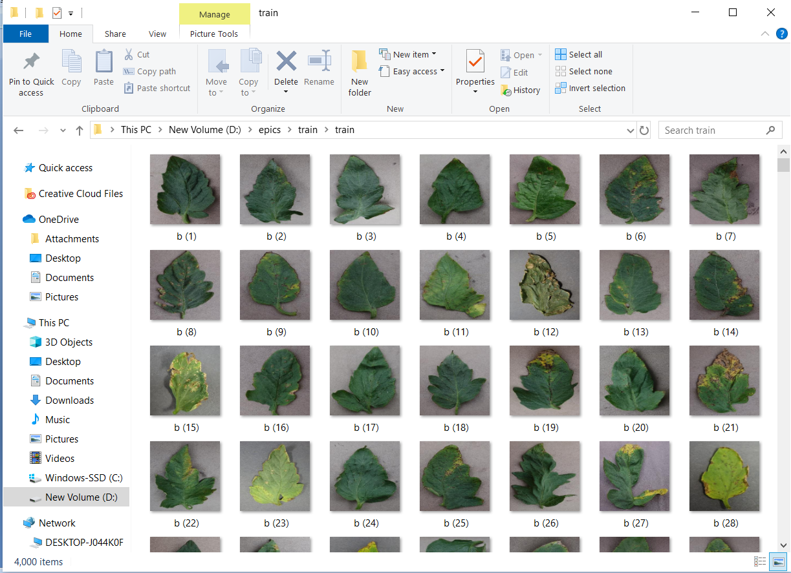
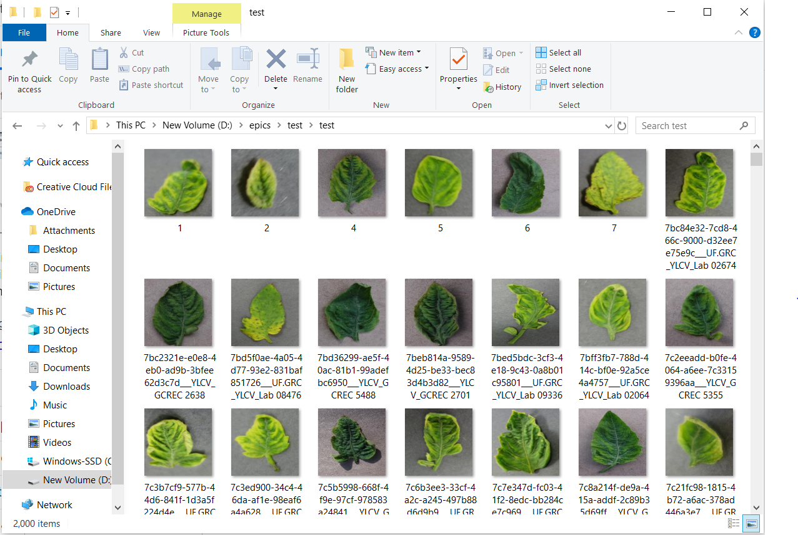

# Tomato-plant-Dataset

<h2> 4 Diseases </h2>
<h4><b> Bacterial_spot, Early_blight, Late_blight, Septoria_leaf_spot </b></h4>

<b><h2> Requirements: </h2></b>
* Download the repository by clicking on the download button or type the following command in CMD to clone the repository:

       git clone https://github.com/AkhilaMadduri/TomatoDataset.git

* Download model from the following link and paste it in the `\4diseases\dataset` folder:

       https://drive.google.com/file/d/1lw5J29JfjF54CIPm6b3qV_c23dEVBbQf/view?usp=sharing
       
* Train data
             
       train_data.py - to generate train images and train labels
       
<b><h2> Screenshots: </h2></b>

<b><h3> Train dataset: </h3></b>

<b><h3> Test dataset: </h3></b>

<h2> 10 diseases </h2>
Dataset of 10 diseases of a tomato plant

<h2><b> Requirements: </b></h2>

 * Download the repository by clicking on the download button or type the following command in CMD to clone the repository:

        git clone https://github.com/AkhilaMadduri/TomatoDataset.git
       
* Download the dataset from [here](https://drive.google.com/open?id=1DVy0LyUUfJciyo7BUFm1sHKSRdTVJgjF)
* We can train the data by using train_data.py file
